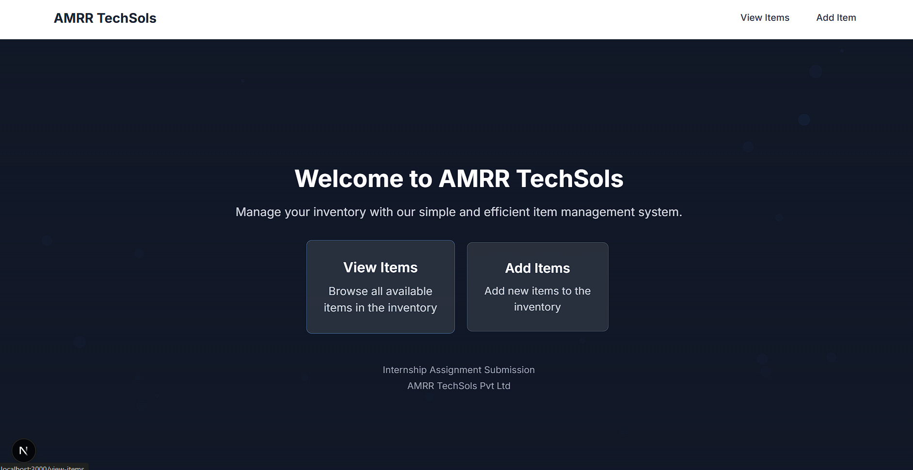

# Item Management System - Internship Assignment

A full-stack web application for managing items with image uploads, database integration, and email notifications. Built with Next.js, MongoDB, and modern React components.

## 🚀 Features



### Core Requirements ✅
- **Add Items Page**: Complete form with item name, type, description, cover image, and additional images
- **View Items Page**: Display all items with cover images and names
- **Item Details Modal**: Click any item to view full details with image carousel
- **Success Messages**: User feedback for successful item additions
- **Responsive Design**: Works on desktop and mobile devices

### Bonus Features Implemented ✅
- **Database Integration**: MongoDB for persistent data storage
- **API Endpoints**: RESTful APIs for fetching and uploading items
- **Email Notifications**: Send enquiry emails via Nodemailer
- **Image Management**: Advanced image handling and carousel functionality
- **Modern UI**: Clean, professional interface with Tailwind CSS

## 🛠 Tech Stack

- **Frontend**: Next.js 15, React 18, TypeScript
- **Styling**: Tailwind CSS, Lucide React Icons
- **Database**: MongoDB
- **Email**: Nodemailer
- **UI Components**: Custom React components with hot-toast notifications
- **Development**: ESLint, Turbopack for fast development

## 📁 Project Structure

```
geer/
├── app/
│   ├── add-item/           # Add new items page
│   ├── view-items/         # View all items page
│   ├── api/
│   │   ├── items/          # Items CRUD API
│   │   └── enquire/        # Email enquiry API
│   └── page.tsx            # Home page
├── components/
│   ├── ImageCarousel.tsx   # Image carousel component
│   ├── ItemCard.tsx        # Item display card
│   ├── ItemModal.tsx       # Item details modal
│   └── Navbar.tsx          # Navigation component
├── lib/
│   ├── db.js              # Database connection
│   ├── email.js           # Email configuration
│   ├── imageLoader.js     # Image handling utilities
│   └── mongoUtils.js      # MongoDB utilities
└── package.json
```

## 🚦 Getting Started

### Prerequisites
- Node.js (v18 or higher)
- MongoDB database (local or MongoDB Atlas)
- Email service credentials (Gmail, SendGrid, etc.)

### Installation

1. **Clone the repository**
   ```bash
   git clone <repository-url>
   cd geer
   ```

2. **Install dependencies**
   ```bash
   npm install
   ```

3. **Environment Setup**
   Create a `.env.local` file in the root directory:
   ```env
   # Database
   MONGODB_URI=your_mongodb_connection_string
   
   # Email Configuration
   EMAIL_HOST=smtp.gmail.com
   EMAIL_PORT=587
   EMAIL_USER=your_email@gmail.com
   EMAIL_PASS=your_app_password
   ENQUIRY_EMAIL=recipient@example.com
   ```

4. **Run the development server**
   ```bash
   npm run dev
   ```

5. **Open your browser**
   Navigate to `http://localhost:3000`

## 📋 Usage

### Adding Items
1. Navigate to "Add Items" page
2. Fill in the form with:
   - Item Name
   - Item Type (Shirt, Pant, Shoes, Sports Gear, etc.)
   - Item Description
   - Cover Image
   - Additional Images (optional)
3. Click "Add Item" to save
4. Success message will confirm the item was added

### Viewing Items
1. Go to "View Items" page
2. Browse all items with cover images and names
3. Click on any item to open detailed view
4. Use the image carousel to view all item images
5. Click "Enquire" to send an email inquiry

## 🔧 API Endpoints

### Items API (`/api/items`)
- **GET**: Fetch all items
- **POST**: Add new item

### Enquiry API (`/api/enquire`)
- **POST**: Send enquiry email

## 📱 Components

### Core Components
- **ItemCard**: Displays item preview with cover image and name
- **ItemModal**: Shows detailed item view with image carousel
- **ImageCarousel**: Handles multiple image display with navigation
- **Navbar**: Navigation between pages

### Features
- Image upload and preview
- Form validation
- Loading states
- Error handling
- Responsive design
- Toast notifications

## 🎨 Styling

- **Tailwind CSS**: Utility-first CSS framework
- **Responsive Design**: Mobile-first approach
- **Modern UI**: Clean, professional interface
- **Dark/Light Mode**: Consistent color scheme
- **Icons**: Lucide React for scalable icons

## 📧 Email Integration

The enquiry system sends emails with:
- Item details
- User contact information
- Timestamp
- Professional formatting

## 🗄️ Database Schema

### Items Collection
```javascript
{
  _id: ObjectId,
  name: String,
  type: String,
  description: String,
  coverImage: String,
  additionalImages: [String],
  createdAt: Date
}
```

## 🚀 Deployment

### Build for Production
```bash
npm run build
npm start
```

### Environment Variables
Ensure all environment variables are set in your production environment.

## 🏆 Bonus Features Completed

1. **✅ Database Integration**: MongoDB with full CRUD operations
2. **✅ Email Functionality**: Nodemailer integration for enquiries
3. **✅ Image Management**: Advanced image handling and carousel
4. **✅ Modern Stack**: TypeScript, Next.js 15, latest React
5. **✅ Professional UI**: Tailwind CSS with responsive design

## 📝 Development Notes

- Used Next.js App Router for modern routing
- Implemented TypeScript for type safety
- Added error boundaries and loading states
- Optimized images and performance
- Followed React best practices
- Clean, maintainable code structure

## 🐛 Troubleshooting

### Common Issues
1. **Database Connection**: Verify MongoDB URI and network access
2. **Email Not Sending**: Check email credentials and SMTP settings
3. **Images Not Loading**: Ensure proper image upload and storage
4. **Build Errors**: Check TypeScript types and dependencies

## 📞 Support

For any questions or issues with this internship assignment, please contact the development team or refer to the documentation.